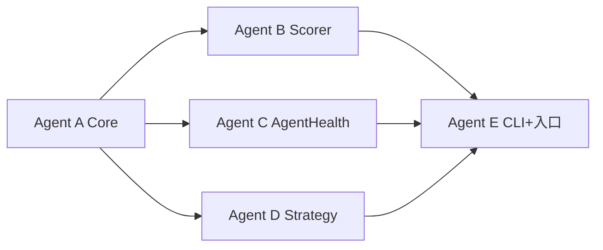

# 机制参数 JSON 外置 + 版本回退 · 开发计划

> 依据：`docs/健康干预仿真_可调参数全景.md` 用户标注  
> 日期：2026-08-09

---

## 1. 目标

1. **未标注「删除」的参数**全部可通过读取 JSON 控制（运行时生效）。
2. **版本控制**：每次改参可存档；可列出历史；可回退到指定版本并激活。
3. **标注「删除」的参数**：不进入 JSON / 控制面板，继续留在代码内部硬编码。
4. **`self_discipline`**：仅允许 `low` / `medium` / `high` 三档。

---

## 2. 参数范围（从标注表推导）

### 2.1 排除（不外置）

| 参数 | 原因 |
|------|------|
| `natural_recovery` | 标注「删除」 |
| `blocked_violation_factor` | 标注「删除」 |
| `MAX_EFFECTIVE_VIOLATIONS` | 标注「删除」 |

### 2.2 纳入控制（其余全部）

**模拟机制**

- 主体：`self_discipline`(仅三档)、`addiction_level`、`resistance_to_persuasion`、`initial_health`、`habit_formation_speed`
- 健康分：`WARNING_LINE`、`plateau_duration`、`decline_rate`、`violation_penalty`、`compliance_bonus`、`mood_sensitivity`、`HEALTH_ZONES/floor_protection`、`habit_bonus/max_penalty`、`IMPROVEMENT_THRESHOLD`（及非线性等价字段）
- 复发：`base_prob`、`discipline_mod`、`addiction_mod`、`time_mod`、`habit_mod`、`tendency_mod`
- 心情 / 遵从 / 行为扣分 / 习惯 / 满意度 / 综合评估：表中其余项

**管理机制**

- 干预等级、潮汐、关系阶段、信任资本、习惯巩固、学习曲线、过度干预保护、周期性反思：表中全部

---

## 3. 架构

```
generative_agents/
├── data/mechanism/
│   ├── active.json              # 当前激活配置（仿真只读这个，或经 loader 解析）
│   ├── defaults/
│   │   └── v0_baseline.json     # 从代码抽出的基线默认值
│   └── versions/
│       ├── manifest.json        # 版本索引
│       └── <version_id>.json    # 每个版本完整快照
├── modules/mechanism_config/
│   ├── __init__.py              # 对外 API
│   ├── schema.py                # 字段定义 / 校验 / 三档自律
│   ├── loader.py                # 读 active、深合并默认、校验
│   ├── version_store.py         # create / list / activate / rollback / diff
│   └── apply.py                 # 把配置注入 Scorer / Strategy / AgentHealth
└── tools/
    └── mechanism_cli.py         # 命令行：list / save / activate / show / diff
```

### 3.1 JSON 顶层结构（约定）

```json
{
  "meta": {
    "version_id": "v0_baseline",
    "name": "baseline",
    "created_at": "2026-08-09T00:00:00",
    "note": "从代码常量抽出"
  },
  "simulation": {
    "subject": { "self_discipline": "medium", "addiction_level": "moderate", ... },
    "health": { "warning_line": 30, "discipline_params": { "low": {...}, "medium": {...}, "high": {...} }, "nonlinear": {...} },
    "relapse": { "base_prob": 0.15, "discipline_mod": {...}, ... },
    "mood": { ... },
    "compliance": { ... },
    "behavior_scores": { ... },
    "habit": { ... },
    "satisfaction": { ... },
    "composite": { ... }
  },
  "management": {
    "intervention": { ... },
    "tidal": { "scenarios": { "diabetes": {...}, ... } },
    "relationship_phases": { ... },
    "trust_capital": { ... },
    "habit_consolidation": { ... },
    "manager_learning": { ... },
    "over_intervention": { ... },
    "reflection": { ... }
  }
}
```

### 3.2 版本控制行为

| 操作 | 行为 |
|------|------|
| `save --name X --note "..."` | 把当前 `active.json`（或指定文件）拷到 `versions/<id>.json`，写入 `manifest.json` |
| `list` | 打印版本 id / name / time / note / 是否 active |
| `activate <id>` | 将该版本复制为 `active.json`；更新 manifest 的 `active_id` |
| `rollback <id>` | 等同 activate（语义强调回退）；可选先 auto-save 当前为 `auto_before_rollback_*` |
| `diff <id_a> <id_b>` | 输出关键路径差异 |
| 仿真启动 | `--mechanism-version <id>` 可选：先 activate 再跑；或只读该版本不改 active |

**原则**

- 版本文件不可变（只追加新版本，不就地改历史文件）。
- 改参流程：编辑 → `save` 成新版本 → `activate` → 跑仿真。
- 仿真 checkpoint 应记录所用 `version_id`，保证可复现。

### 3.3 注入策略（避免大重构）

1. `get_mechanism_config()` 单例：启动时 load `active.json`（或 CLI 指定路径）。
2. 各类原先读类常量处改为：`cfg.get("simulation.health...", default=原常量)`。
3. **删除项**不读 JSON，继续用类内硬编码。
4. `self_discipline`：loader 校验，非法值报错或 clamp 到三档。

---

## 4. 模块任务拆分（多 Agent）

| Agent | 职责 | 主要文件 | 依赖 |
|-------|------|----------|------|
| **A · Core** | schema、defaults、loader、version_store、`__init__` API、baseline JSON | `modules/mechanism_config/*`、`data/mechanism/**` | 无 |
| **B · Scorer** | 健康分 / 满意度 / 心情 / 综合 / 行为扣分读 config | `scorer.py`、`scorer_nonlinear.py` | A |
| **C · AgentHealth** | 复发 / 心情分布 / 习惯 streak / 遵从抵抗读 config | `agent_health.py` | A |
| **D · Strategy** | 潮汐 / 阶段 / 信任 / 学习 / 过度干预 / 反思读 config | `strategy.py` | A |
| **E · CLI+入口** | `mechanism_cli.py`；`start_health_simulation*.py` 接 `--mechanism-config` / `--mechanism-version`；checkpoint 写 version_id；简短 README | `tools/`、`start_*.py`、`docs/` | A（后接 B/C/D） |

### 4.1 对外 API（冻结，供 B/C/D 调用）

```python
# modules/mechanism_config/__init__.py
def load_mechanism_config(path: str | None = None) -> dict: ...
def get_mechanism_config() -> dict: ...          # 进程内单例
def set_mechanism_config(cfg: dict) -> None: ... # 测试用
def get_path(dotted: str, default=None): ...     # 如 "simulation.relapse.base_prob"

class VersionStore:
    def save(self, name: str, note: str = "", source_path: str | None = None) -> str: ...
    def list_versions(self) -> list[dict]: ...
    def activate(self, version_id: str) -> None: ...
    def rollback(self, version_id: str, autosave: bool = True) -> str: ...
    def diff(self, a: str, b: str) -> dict: ...
    def get_active_id(self) -> str | None: ...
```

### 4.2 验收标准

- [ ] 改 `active.json` 中 `simulation.relapse.base_prob` 后，不改代码即可影响复发计算
- [ ] `save` → 改参 → `save` → `rollback` 到上一版 → 行为恢复
- [ ] 传入 `self_discipline=very_high` 被拒绝或规范化
- [ ] 删除的三项无法通过 JSON 覆盖（改 JSON 里即使手写也不生效 / schema 拒绝多余字段可选）
- [ ] 仿真结果或 checkpoint 含 `mechanism_version_id`

---

## 5. 实施顺序



1. **A 先完成**（阻塞依赖）
2. **B / C / D 并行**
3. **E 收尾集成与文档**

---

## 6. 非目标（本轮不做）

- Web UI 改参面板（可后续接同一 JSON）
- 自动从 Markdown 表同步 schema
- 改「删除」三项的代码逻辑（保持原硬编码即可）
- 与 git 绑定的版本（文件快照即可，不依赖 git commit）

---

## 7. 使用说明

工作目录：`generative_agents/`。

### 机制版本 CLI

```bash
# 列出版本
python tools/mechanism_cli.py list

# 查看 active / 指定版本摘要
python tools/mechanism_cli.py show
python tools/mechanism_cli.py show --version v0_baseline

# 把当前 active 存为新版本
python tools/mechanism_cli.py save --name 实验A --note "提高复发基线"

# 激活 / 回退（rollback 默认先 autosave 当前）
python tools/mechanism_cli.py activate <version_id>
python tools/mechanism_cli.py rollback <version_id>

# 比较两个版本
python tools/mechanism_cli.py diff <id_a> <id_b>
```

### 仿真入口

```bash
# 默认：加载 data/mechanism/active.json
python start_health_simulation.py --scenario diabetes --days 90

# 指定配置文件（只 load 进进程，不改 active）
python start_health_simulation.py --scenario diabetes --mechanism-config data/mechanism/active.json

# 指定版本（只 load 进进程，不 activate）
python start_health_simulation.py --scenario diabetes --mechanism-version v0_baseline

# visual 入口同样支持上述两个参数
python start_health_simulation_visual.py --scenario phone-addiction --mechanism-version v0_baseline
```

启动日志会打印 `version_id` / `name`；checkpoint 与 `complete_results.json` 的 metadata 含 `mechanism_version_id`。
